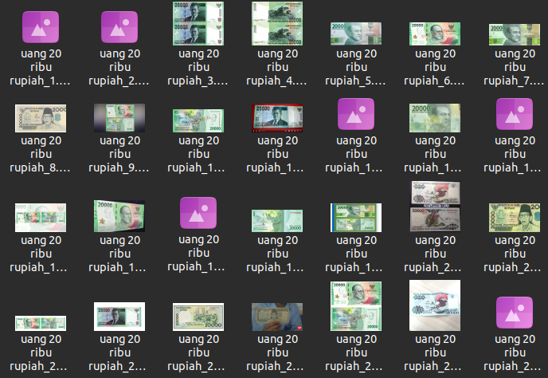

# Web Scraping for Data Science
Web scraping on Shopee, Twitter, Tokopedia, Bukalapak, Kompas.com, Tiket.com, Yell.com (Traveloka look like) using API and BeautifulSoup to get all data either text, values, even images. We also automate to send the data to WhatsApp using pywhatkit.

## New Feature
Can scrape all images you needed for computer vision purposes in single-click
### Installation
```Python
conda create -n image_scraper_env python=3.9
conda activate image_scraper_env
pip install -r requirements.txt
```
### How to Use
```Python
python image_scraper_bing.py
OR python image_scraper_fast.py
```




